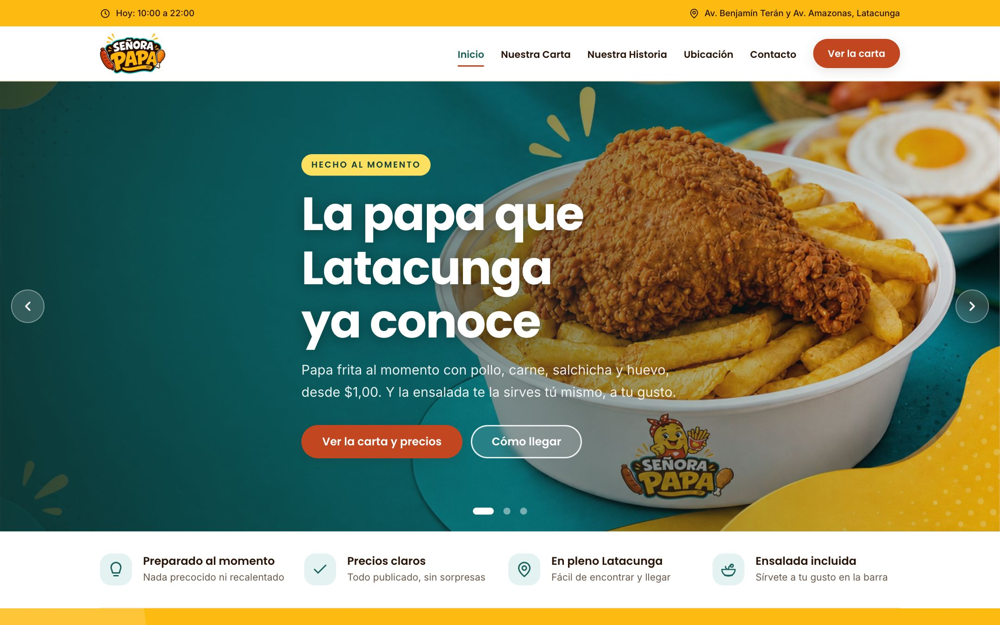
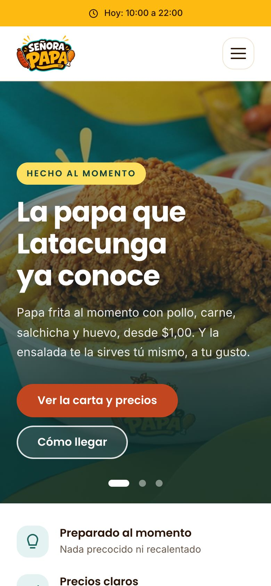
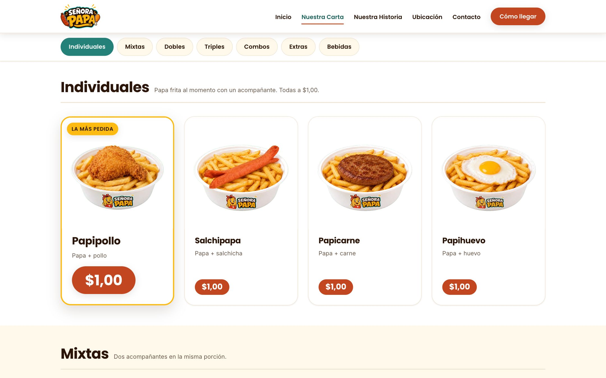
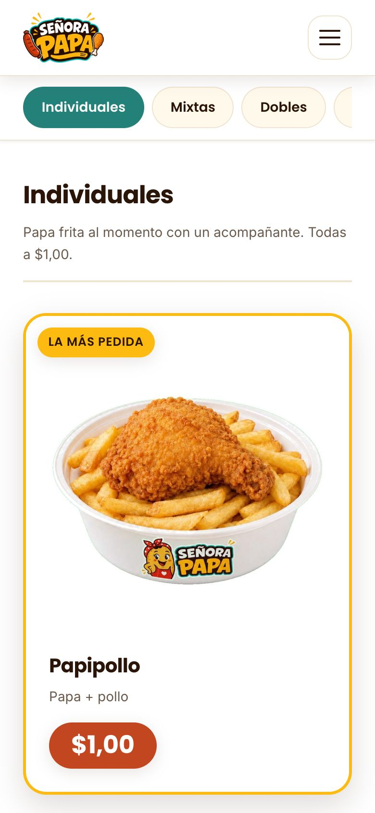

# Señora Papa — Restaurant Website

🇨🇦 English · [🇪🇨 Español](README.es.md)

Production website for **Señora Papa**, a family-run fast-food restaurant in
Latacunga, Ecuador, built with **HTML, CSS and vanilla JavaScript**: no
frameworks, no dependencies, no build step.

**🌐 Live: [senorapapa.com](https://senorapapa.com)**


<p align="center">
  
  &nbsp;
  
</p>

---

## The problem

The restaurant had no web presence beyond social media. Customers kept asking
the same three things: *what's on the menu, how much does it cost, and where
are you?* The site answers those three questions fast, on a phone, on a mobile
data connection, and it is simple enough for a non-technical owner to keep up
to date.

## What it does

| Page | What's there |
|---|---|
| **Home** | Rotating hero, menu categories, best sellers, map and live opening status |
| **Menu** | 31 items across 7 categories, all with photos and prices |
| **Our Story** | The business's history as a timeline, from a street stall in 2015 to its own restaurant |
| **Location** | Embedded map, directions, opening hours with today highlighted |
| **Contact** | Social media links and an FAQ |
| **404** | Custom error page that sends visitors back to the home page or the menu |

<p align="center">
  
  &nbsp;
  
</p>

## Technical highlights

**Accessibility, built in rather than added on later**
- Carousel follows the WAI-ARIA pattern: keyboard arrows, pause on hover and
  focus, pause when the tab is hidden, and hidden slides removed from the tab
  order.
- Respects `prefers-reduced-motion`: the carousel stops auto-rotating.
- Brand colors have separate darker `-texto` variants so every text/background
  pair meets **WCAG AA (4.5:1)** contrast.
- Touch targets are at least 24×24 px (WCAG 2.2), skip link, semantic
  landmarks, `aria-current` navigation, and a mobile menu that closes with Escape.

**Time-zone-aware "Open now" badge**
- Hours live in one JS object. The script computes whether the restaurant is
  open **in Ecuador's time zone** (`America/Guayaquil`), not the visitor's, so
  someone abroad checking before a trip gets the right answer.
- Handles closing times past midnight and days the restaurant is closed,
  with a manual UTC−5 fallback for old browsers.

**SEO and local search**
- `schema.org/Restaurant` JSON-LD with address, geo-coordinates and opening
  hours, which makes the site eligible for Google rich results.
- Open Graph tags per page for WhatsApp and Facebook previews, plus canonical
  URLs, `sitemap.xml` and `robots.txt`.
- Prices are **in the HTML, not loaded by JS**, so they're indexable and still
  visible if a script fails, and they're the reason people visit.

**Performance**
- Explicit `width`/`height` on every image → **zero layout shift** (CLS 0).
- `srcset` for the hero images, `fetchpriority="high"` on the LCP image,
  and native lazy loading everywhere else.
- Menu scroll-spy uses `IntersectionObserver` instead of scroll listeners.
- Total JavaScript: **one 15 KB file**, loaded with `defer`.

**Resilience**
- A missing photo shows a labeled placeholder instead of a broken-image icon,
  so the owner knows exactly which file to add.
- A print stylesheet makes the menu page printable.

## Lighthouse

| | Performance | Accessibility | Best Practices | SEO |
|---|:-:|:-:|:-:|:-:|
| **Mobile** | 83 – 93 | 100 | 100 | 100 |
| **Desktop** | 98 – 99 | 100 | 100 | 100 |

<sub>Lighthouse 9, measured across the five content pages (simulated throttling).
The 404 page is intentionally `noindex` and excluded from the SEO figure.</sub>

## Engineering decisions

**Why no framework?** The site is five pages of content that changes a few
times a year. A framework would add a build pipeline, dependency updates and
a Node toolchain that the person maintaining it would have to learn. Plain
HTML means a price change is: open the file, edit the number, push.

**Why no contact form?** A static site has no server to receive messages, and
the business already answers Facebook, Instagram and TikTok every day. A form
nobody reads would be worse than no form at all, so the Contact page sends
people to the channels that actually get replies.

**Why derive the palette from the logo?** Colors were sampled from the logo
and the printed in-store menu and centralized as CSS custom properties, so
the website and the physical menu read as the same brand. Changing the theme
means editing one block at the top of the stylesheet.

## Project structure

```
senora-papa-web/
├── sitio/                  ← everything that gets published
│   ├── index.html · menu.html · historia.html · ubicacion.html · contacto.html · 404.html
│   ├── css/estilos.css     One stylesheet; design tokens at the top
│   ├── js/principal.js     Mobile menu, carousel, scroll-spy, opening hours
│   ├── assets/             Images and icons
│   └── sitemap.xml · robots.txt · site.webmanifest
├── docs/capturas/          Screenshots for this README
├── README.md
└── README.es.md
```

The code (class names, comments) is in Spanish because the person who
maintains the site day to day is a Spanish speaker.

## Run it locally

```bash
git clone https://github.com/BryanIGD/senora-papa-web.git
cd senora-papa-web/sitio
python3 -m http.server 8000
```

Then open <http://localhost:8000>. No install step.

## Deployment

Hosted on **Cloudflare Pages** with the build output directory set to `sitio`.
Every push to `main` goes live in about 30 seconds, and any previous
deployment can be restored in one click.

## Roadmap

- **English version**: in progress, with `hreflang` alternates and a language switcher.
- **Single source for opening hours**: they're currently repeated in the JS,
  the Location table and the JSON-LD; generating the latter two from the JS
  object would remove the risk of them drifting apart.
- **Self-hosted fonts and WebP/AVIF images**: the two remaining items holding
  mobile performance below 90 on the home page.
